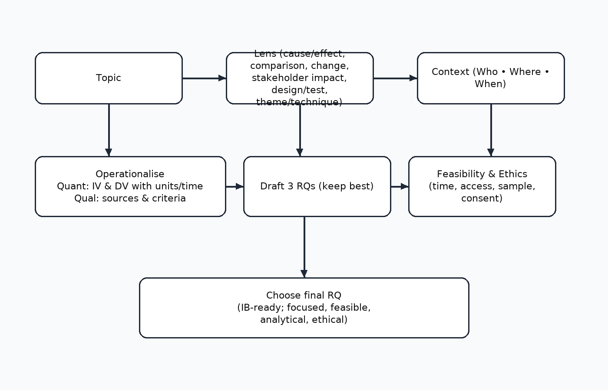
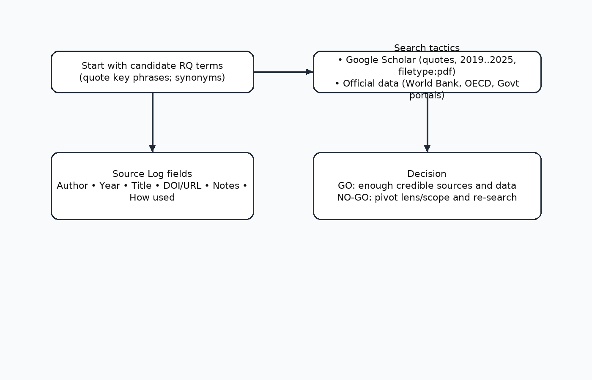
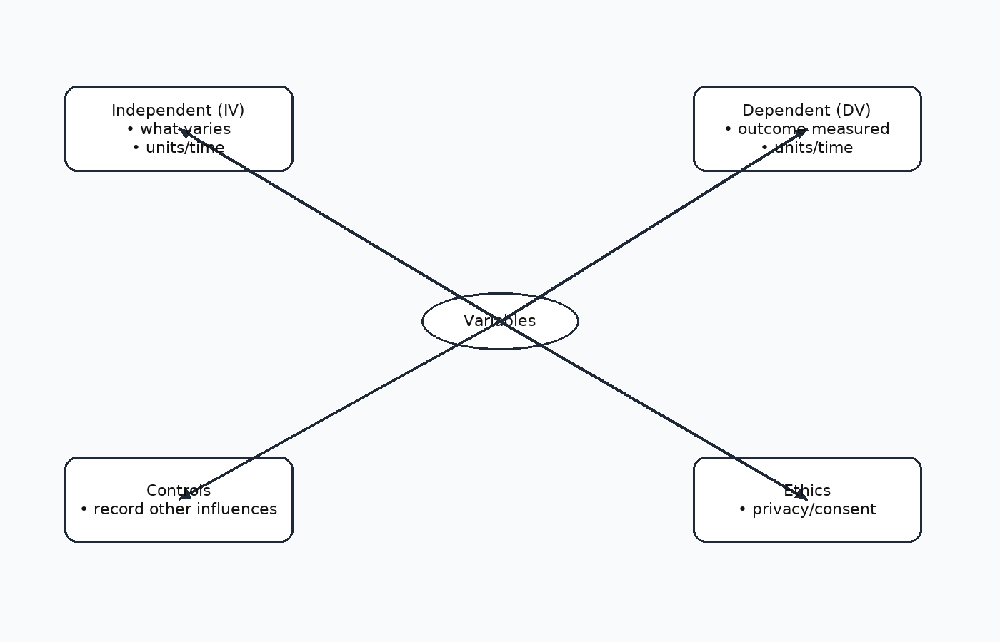

title: IB EE/IA Boot Camp — Day 1: From Topic to Research Question
author: SkillNestEdu

# Welcome + promise
Today you’ll turn a broad interest into 3–5 strong, IB-aligned research-question (RQ) candidates that are **focused, feasible, analytical, and ethical**.  
**Output:** 1 short-listed RQ + a 10-min feasibility plan.

---
# Learning goals (mapped to IB)
- Identify what makes a *good* RQ in your subject.
- Use a repeatable process to go from topic → question.
- Scope sources fast and log them correctly.
- Translate ideas into *operational* terms (what you’ll actually measure).

*Speaker notes:* keep it practical; build confidence with quick wins; everything maps to criteria around Focus/Method/Research.

---
# What makes a good RQ?
**FOCUSED** • not too broad or trivial  
**FEASIBLE** • data accessible in time/ethics limits  
**ANALYTICAL** • invites explanation/relationship, not “describe”  
**SUBJECT-SPECIFIC** • uses the discipline’s tools/criteria  
**ETHICAL & SAFE** • no harm; school policies; consent where needed  
**TIME-BOUNDED** • doable with resources and word/page limits

*Speaker notes:* tie each bullet to IB criterion language for EE/IA (focus, method, analysis).

---
# Good vs weak — cross-subject examples
**Economics**  
- Weak: “How did inflation affect India?”  
- Better: “To what extent did supply-side factors (imported crude) explain the CPI spike in India (2022–23) relative to demand-side factors?”  

**Business Management**  
- Weak: “Is marketing important for Starbucks?”  
- Better: “How effective was Starbucks’ 2023 UPI-based loyalty program in raising visit frequency among Gen Z customers in Bengaluru?”  

**Biology**  
- Weak: “Do plants grow better with fertilizer?”  
- Better: “How does 0.1% vs 0.3% NPK solution affect mean root length of *Arabidopsis thaliana* over 14 days under constant light?”

**Psychology**  
- Weak: “Does music affect memory?”  
- Better: “What is the effect of instrumental vs lyrical music during encoding on immediate recall accuracy for 20 word-pairs (within-subjects)?”

*Speaker notes:* show “rewrite path”: topic → add population → add variables → add comparison → add timeframe.

---
# A reliable recipe (use this every time)

**Steps**  
1) Start with interest + context  
2) Identify dependent outcome (what changes)  
3) List candidate causes/comparators  
4) Narrow scope (who/where/when)  
5) Choose method/data type (primary/secondary)  
6) Phrase as question that implies analysis

*Speaker notes:* keep students moving; they can iterate later.

---
# Quick scoping search (10–12 minutes)

**Tactics**  
- Google: `"your phrase" site:.gov filetype:pdf`  
- Stats portals: World Bank, IMF, OECD, UNdata; RBI; NSO  
- Academic: Google Scholar; sort by date; read abstracts first  
- Save permalinks/DOIs; copy key quotes with page numbers

**Log template columns**: Author • Year • Title • Source/URL • Notes • How I’ll use it

*Speaker notes:* model one live search from a student prompt.

---
# Operationalize your idea

Turn concepts into *measurable* variables.  
- Economics: “market power” → Herfindahl index; “impact” → % change in quantity, price, market share  
- BM: “loyalty” → visit frequency, redemption rate  
- Bio: “growth” → mean root length (mm), leaf count  
- Psych: “memory” → correct recalls /20; reaction time (ms)

*Speaker notes:* the moment students see what they would actually record.

---
# Primary vs Secondary data (pick your lane)
**Primary** (you collect): surveys, interviews, experiments, observations.  
Pros: custom; control. Cons: time/ethics, sampling bias.  

**Secondary** (already published): government stats, company reports, APIs, journals.  
Pros: fast; credible. Cons: fit/gaps, definitions differ.

**Rule of thumb**: if credible secondary exists, start there; add a small primary component only if it clearly adds value.

---
# Hypothesis, prediction, or aim?
- **Hypothesis** (for inferential/experimental): “X will be associated with Y (direction).”  
- **Prediction** (descriptive model): “Feature A will explain more variance than B.”  
- **Aim** (qualitative/desk-based): “To evaluate whether Policy P met Goal G using criteria C1–C3.”

*Speaker notes:* students don’t all need an H₀/H₁—depends on subject and method.

---
# Feasibility checklist (go/no-go)
- Access to data/instruments in 7–10 days  
- Sample size realistic (avoid n<20 unless **case-study** design fits)  
- Clear operational definitions & measures  
- Ethics: consent/assent; no deception/ harm  
- Analysis plan you can execute (e.g., correlation + chart; content coding framework; cost-benefit grid)

**If “no” on ≥2 items → narrow or pivot.**

---
# Mini-task 1 (8 min)
Pick one topic and pass the **FOCUS test** by adding: population, place, time, variables.  
Write 2 candidate RQs.

**Template**  
“In/For [population/place/time], how/what is the relationship/effect between [X] and [Y] measured by [metric] using [data source/method]?”

---
# Mini-task 2 (10 min)
Do a **scoping search** for each RQ.  
Log 3 credible sources and 1 likely dataset.  
Decide **primary vs secondary**.  
Revise the RQ once.

*Speaker notes:* circulate; nudge students to replace vague nouns.

---
# Retrieval check (3 min)
- Define **operationalization** in one sentence.  
- List two advanced Google search operators.  
- Is “Do people like product X?” a good RQ? Why not? Rewrite.

---
# Exit ticket (2 min)
Post your *best* RQ and the single dataset or method you’ll use.

---
# Homework (20–30 min)
- Log **5** sources in your source-log sheet.  
- Draft a **data plan**: variable names, measures, where you’ll get them.  
- Bring **one figure** (table/chart/diagram) you expect to include.

**Downloads**  
- Source-log CSV: `/downloads/source-log.csv`  
- EE/IA outline TXT: `/downloads/ee-ia-outline.txt`

---
# Appendix (quick reference)
**Good RQ litmus**  
Focused • Feasible • Analytical • Subject-specific • Ethical • Time-bounded

**Common pitfalls**  
Too broad; “prove that X is good”; no data; description only.

